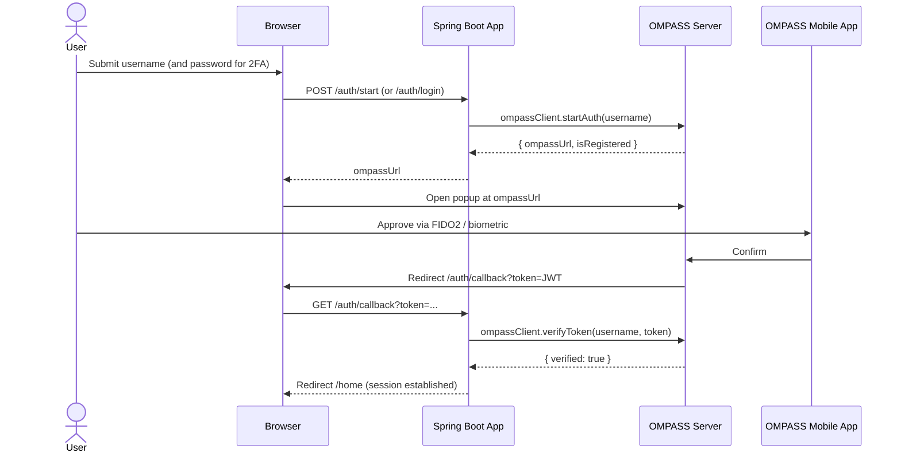
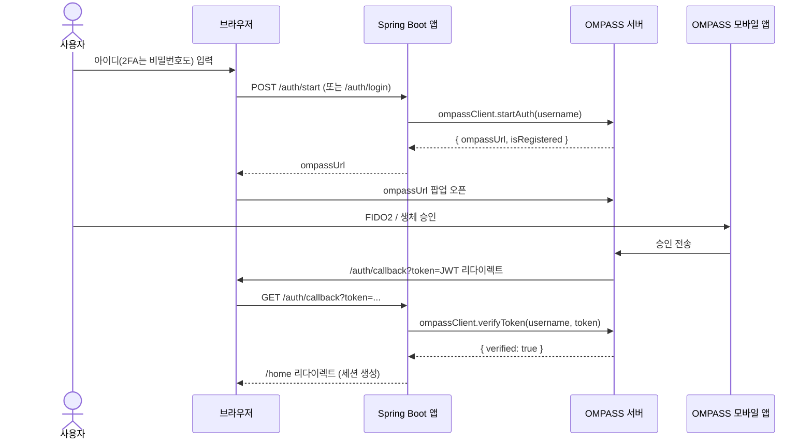

# OMPASS SDK Java Spring Boot Example

[English](#english) | [한국어](#한국어)

---

## English

A Spring Boot demo application showing how to integrate the **OMPASS Java SDK** for multi-factor authentication (MFA) and FIDO2 passwordless login. The app implements a minimal "DemoMail" webmail UI with full registration, login, and account-settings flows.

### Overview

The demo shows three core scenarios:

1. **Sign up** with username, email, name, and password (stored in H2 in-memory DB).
2. **Login** with either:
   - Password + OMPASS 2FA (one-time biometric/FIDO2 approval on a mobile device), or
   - Passwordless OMPASS-only authentication (after the user has registered an authenticator).
3. **Settings** to register/revoke OMPASS authenticators and toggle passwordless mode.

### Authentication Flow



### Tech Stack

| Layer | Technology |
|-------|------------|
| Runtime | Java 17 (this example) — **OMPASS SDK supports Java 8+** |
| Framework | Spring Boot 3.2.0 |
| Web view | Thymeleaf + `thymeleaf-extras-springsecurity6` |
| Security | Spring Security |
| Persistence | Spring Data JPA + H2 (in-memory) |
| MFA | `com.ompasscloud.sdk:ompass-java-sdk:1.0.2` |
| Build | Maven 3 |

### Prerequisites

- JDK 17 or later (required by Spring Boot 3.2 in this example; the OMPASS Java SDK itself supports **Java 8 and above**)
- Maven 3.x
- An **OMPASS** tenant with:
  - `client-id` and `secret-key` issued from the OMPASS admin console
  - Callback URL whitelisted: `https://localhost:8443/auth/callback`
- (For end-to-end testing) The OMPASS mobile app installed on a device

### Configuration

OMPASS settings live under the `ompass` namespace in `src/main/resources/application.yml`:

| Key | Description |
|-----|-------------|
| `ompass.client-id` | OMPASS API client identifier |
| `ompass.secret-key` | OMPASS API signing key (**secret**) |
| `ompass.base-url` | OMPASS backend endpoint (e.g. `https://api.ompasscloud.com`) |

> **Security note** — Do **not** commit real secrets to `application.yml`. Override at runtime via environment variables and reference them in YAML:
>
> ```yaml
> ompass:
>   client-id: ${OMPASS_CLIENT_ID}
>   secret-key: ${OMPASS_SECRET_KEY}
>   base-url: ${OMPASS_BASE_URL}
> ```
>
> ```bash
> export OMPASS_CLIENT_ID=...
> export OMPASS_SECRET_KEY=...
> export OMPASS_BASE_URL=https://api.ompasscloud.com
> ```

The bundled `src/main/resources/keystore` (JKS, password `changeit`) is a **self-signed certificate for local development only**. Replace it with a CA-issued certificate for any non-local environment.

### Quick Start

```bash
git clone git@github.com:OMSecurity/ompass-sdk-java-spring-boot-example.git
cd ompass-sdk-java-spring-boot-example

# Configure OMPASS credentials via env vars (recommended)
export OMPASS_CLIENT_ID=your-client-id
export OMPASS_SECRET_KEY=your-secret-key
export OMPASS_BASE_URL=https://api.ompasscloud.com

mvn spring-boot:run
```

Open `https://localhost:8443` in a browser. Because the bundled keystore is self-signed, your browser will show a warning — click "Advanced → Proceed" to continue.

The H2 console is exposed at `https://localhost:8443/h2-console` (JDBC URL: `jdbc:h2:mem:ompassdb`, user: `sa`, no password).

### Project Structure

```
src/main/java/com/ompasscloud/example/
├── OmpassExampleApplication.java   # Spring Boot entry point
├── config/
│   ├── OmpassClientConfig.java     # Builds the OmpassClient bean
│   ├── OmpassProperties.java       # Maps ompass.* config keys
│   ├── SecurityConfig.java         # Spring Security filter chain
│   └── WebMvcConfig.java           # i18n locale resolver + interceptor
├── controller/
│   ├── AuthController.java         # Registration, login, MFA endpoints
│   └── HomeController.java         # Home, settings, logout pages
├── domain/
│   └── User.java                   # JPA entity
├── repository/
│   └── UserRepository.java         # Spring Data JPA repository
└── service/
    ├── OmpassAuthService.java      # Wraps the OMPASS SDK
    └── UserService.java            # User registration & password handling

src/main/resources/
├── application.yml                 # Server SSL, datasource, OMPASS, i18n, logging
├── keystore                        # Dev-only self-signed JKS
├── messages.properties             # Default (English fallback)
├── messages_en.properties          # English
├── messages_ko.properties          # Korean
├── messages_ja.properties          # Japanese
├── static/css/style.css
└── templates/                      # Thymeleaf templates
    ├── index.html, home.html, settings.html
    ├── login.html, register.html
    ├── ompass-auth.html            # OMPASS popup launcher
    └── auth-callback.html          # Callback result page
```

### HTTP Endpoints

**Pages**

| Method | Path | Purpose |
|--------|------|---------|
| GET | `/` | Landing page |
| GET, POST | `/register` | Sign-up form & handler |
| GET, POST | `/login` | Login form & password verification |
| GET | `/home` | Authenticated inbox view |
| GET | `/settings` | Account settings page |
| GET | `/logout` | Invalidate session |

**OMPASS authentication (JSON, except `/auth/login` and `/auth/callback`)**

| Method | Path | Purpose |
|--------|------|---------|
| POST | `/auth/check-user` | Check whether a user has OMPASS authenticators registered |
| POST | `/auth/start` | Start an OMPASS challenge, returns popup URL |
| POST | `/auth/login` | Password login that triggers OMPASS 2FA when registered |
| POST | `/auth/register-ompass` | Begin OMPASS authenticator enrollment from settings |
| POST | `/auth/toggle-passwordless` | Switch between passwordless and 2FA modes |
| POST | `/auth/delete-ompass` | Revoke all OMPASS authenticators for the user |
| GET | `/auth/callback` | OMPASS redirect target — verifies token and establishes the session |

### OMPASS SDK Integration

`OmpassClientConfig` builds a single `OmpassClient` bean from `OmpassProperties`. `OmpassAuthService` is the only class that talks to the SDK and exposes a small surface used by the controller:

| `OmpassAuthService` method | Underlying SDK call | Purpose |
|----------------------------|--------------------|---------|
| `startAuth(username)` | `OmpassClient.startAuth(AuthStartRequest)` | Initiates a challenge; returns the popup URL |
| `verifyToken(username, token)` | `OmpassClient.verifyToken(TokenVerifyRequest)` | Validates the JWT delivered to `/auth/callback` |
| `hasAuthenticators(username)` | `OmpassClient.getAuthenticators(username)` | Whether the user has registered devices |
| `getAuthenticators(username)` | `OmpassClient.getAuthenticators(username)` | List authenticator metadata |
| `deleteAuthenticator(id)` | `OmpassClient.deleteAuthenticator(id)` | Revoke one authenticator |
| `deleteAllAuthenticators(username)` | Iterates the two above | Revoke all |

### Internationalization

The app ships with three locale bundles:

- `en` — English (default fallback)
- `ko` — Korean
- `ja` — Japanese

Locale is resolved by `CookieLocaleResolver` (cookie name `lang`) and can be switched at any time with the `lang` query parameter:

```
https://localhost:8443/?lang=ko
https://localhost:8443/?lang=en
https://localhost:8443/?lang=ja
```

The choice is then persisted in the `lang` cookie.

### Production Notes

- Externalize `ompass.client-id` / `ompass.secret-key` (env vars, Spring Cloud Config, Vault, etc.).
- Replace the bundled self-signed keystore with a CA-issued certificate.
- Replace H2 with a persistent database (PostgreSQL, MySQL, …) and set `spring.jpa.hibernate.ddl-auto` to `validate` or `none` together with a real migration tool.
- Disable the H2 console (`spring.h2.console.enabled: false`).
- Keep `server.servlet.session.cookie.secure: true` and `same-site: none` so the OMPASS redirect works across the popup boundary.

### License

TBD.

---

## 한국어

**OMPASS Java SDK**를 Spring Boot에 통합하여 다중 인증(MFA)과 FIDO2 패스워드리스 로그인을 구현하는 데모 애플리케이션. 가입/로그인/설정 화면을 갖춘 미니 "DemoMail" 웹메일 형태로, SDK 적용 흐름을 한눈에 볼 수 있게 구성됨.

### 개요

데모는 세 가지 시나리오를 보여줌:

1. 아이디/이메일/이름/비밀번호로 **회원가입** (H2 인메모리 DB 저장).
2. 다음 중 한 방식으로 **로그인**:
   - 비밀번호 + OMPASS 2차 인증 (모바일에서 생체/FIDO2로 1회 승인), 또는
   - 인증장치 등록 후 OMPASS만으로 **패스워드리스** 로그인.
3. **설정**에서 OMPASS 인증장치 등록·해제 및 패스워드리스 모드 토글.

### 인증 플로우



### 기술 스택

| 계층 | 기술 |
|------|------|
| 런타임 | Java 17 (이 예제 기준) — **OMPASS SDK 최소 지원 버전은 Java 8** |
| 프레임워크 | Spring Boot 3.2.0 |
| 뷰 | Thymeleaf + `thymeleaf-extras-springsecurity6` |
| 보안 | Spring Security |
| 영속성 | Spring Data JPA + H2 (인메모리) |
| MFA | `com.ompasscloud.sdk:ompass-java-sdk:1.0.2` |
| 빌드 | Maven 3 |

### 사전 요구사항

- JDK 17 이상 (이 예제는 Spring Boot 3.2 요구사항 때문이며, OMPASS Java SDK 자체는 **Java 8 이상**에서 동작)
- Maven 3.x
- **OMPASS** 테넌트:
  - OMPASS 어드민 콘솔에서 발급받은 `client-id` / `secret-key`
  - 콜백 URL 화이트리스트 등록: `https://localhost:8443/auth/callback`
- (실제 인증 시연용) 모바일 OMPASS 앱이 설치된 디바이스

### 설정

`src/main/resources/application.yml`의 `ompass` 네임스페이스에서 SDK 설정을 관리함:

| 키 | 설명 |
|----|------|
| `ompass.client-id` | OMPASS API 클라이언트 식별자 |
| `ompass.secret-key` | OMPASS API 서명 키 (**비밀**) |
| `ompass.base-url` | OMPASS 백엔드 엔드포인트 (예: `https://api.ompasscloud.com`) |

> **보안 주의** — 시크릿 값을 `application.yml`에 직접 커밋하지 말 것. 환경변수로 주입하고 YAML에서 참조하는 방식을 권장:
>
> ```yaml
> ompass:
>   client-id: ${OMPASS_CLIENT_ID}
>   secret-key: ${OMPASS_SECRET_KEY}
>   base-url: ${OMPASS_BASE_URL}
> ```
>
> ```bash
> export OMPASS_CLIENT_ID=...
> export OMPASS_SECRET_KEY=...
> export OMPASS_BASE_URL=https://api.ompasscloud.com
> ```

번들된 `src/main/resources/keystore`(JKS, 비밀번호 `changeit`)는 **로컬 개발용 자체 서명 인증서**. 운영 환경에서는 반드시 CA가 발급한 인증서로 교체해야 함.

### 빠른 시작

```bash
git clone git@github.com:OMSecurity/ompass-sdk-java-spring-boot-example.git
cd ompass-sdk-java-spring-boot-example

# 환경변수로 OMPASS 자격증명 주입 (권장)
export OMPASS_CLIENT_ID=your-client-id
export OMPASS_SECRET_KEY=your-secret-key
export OMPASS_BASE_URL=https://api.ompasscloud.com

mvn spring-boot:run
```

브라우저에서 `https://localhost:8443` 접속. 자체 서명 인증서이므로 브라우저 경고가 뜨면 "고급 → 계속 진행"으로 우회.

H2 콘솔: `https://localhost:8443/h2-console` (JDBC URL `jdbc:h2:mem:ompassdb`, 사용자 `sa`, 비밀번호 없음).

### 프로젝트 구조

```
src/main/java/com/ompasscloud/example/
├── OmpassExampleApplication.java   # Spring Boot 진입점
├── config/
│   ├── OmpassClientConfig.java     # OmpassClient 빈 생성
│   ├── OmpassProperties.java       # ompass.* 설정 바인딩
│   ├── SecurityConfig.java         # Spring Security 필터 체인
│   └── WebMvcConfig.java           # i18n 로케일 리졸버 + 인터셉터
├── controller/
│   ├── AuthController.java         # 가입/로그인/MFA 엔드포인트
│   └── HomeController.java         # 홈, 설정, 로그아웃 페이지
├── domain/
│   └── User.java                   # JPA 엔티티
├── repository/
│   └── UserRepository.java         # Spring Data JPA 리포지토리
└── service/
    ├── OmpassAuthService.java      # OMPASS SDK 래퍼
    └── UserService.java            # 사용자 등록 및 비밀번호 처리

src/main/resources/
├── application.yml                 # 서버 SSL, 데이터소스, OMPASS, i18n, 로깅
├── keystore                        # 개발용 자체 서명 JKS
├── messages.properties             # 기본(영어) 메시지
├── messages_en.properties          # 영어
├── messages_ko.properties          # 한국어
├── messages_ja.properties          # 일본어
├── static/css/style.css
└── templates/                      # Thymeleaf 템플릿
    ├── index.html, home.html, settings.html
    ├── login.html, register.html
    ├── ompass-auth.html            # OMPASS 팝업 런처
    └── auth-callback.html          # 콜백 결과 페이지
```

### HTTP 엔드포인트

**페이지**

| 메서드 | 경로 | 용도 |
|--------|------|------|
| GET | `/` | 랜딩 페이지 |
| GET, POST | `/register` | 가입 폼 및 처리 |
| GET, POST | `/login` | 로그인 폼 및 비밀번호 검증 |
| GET | `/home` | 로그인 후 받은편지함 화면 |
| GET | `/settings` | 계정 설정 페이지 |
| GET | `/logout` | 세션 종료 |

**OMPASS 인증 (JSON, 단 `/auth/login`과 `/auth/callback` 제외)**

| 메서드 | 경로 | 용도 |
|--------|------|------|
| POST | `/auth/check-user` | 사용자의 OMPASS 인증장치 등록 여부 조회 |
| POST | `/auth/start` | OMPASS 인증 시작, 팝업 URL 반환 |
| POST | `/auth/login` | 비밀번호 로그인 (등록 사용자는 OMPASS 2FA 트리거) |
| POST | `/auth/register-ompass` | 설정 화면에서 OMPASS 인증장치 등록 시작 |
| POST | `/auth/toggle-passwordless` | 패스워드리스/2FA 모드 전환 |
| POST | `/auth/delete-ompass` | 사용자의 모든 OMPASS 인증장치 해제 |
| GET | `/auth/callback` | OMPASS 리다이렉트 수신 — 토큰 검증 후 세션 생성 |

### OMPASS SDK 통합 포인트

`OmpassClientConfig`가 `OmpassProperties`를 받아 `OmpassClient` 빈을 단일 생성. SDK 호출은 모두 `OmpassAuthService`로 캡슐화되어 컨트롤러에서는 작은 메서드 표면만 사용:

| `OmpassAuthService` 메서드 | 내부 SDK 호출 | 동작 |
|----------------------------|---------------|------|
| `startAuth(username)` | `OmpassClient.startAuth(AuthStartRequest)` | 인증 챌린지 시작, 팝업 URL 반환 |
| `verifyToken(username, token)` | `OmpassClient.verifyToken(TokenVerifyRequest)` | `/auth/callback`로 들어온 JWT 검증 |
| `hasAuthenticators(username)` | `OmpassClient.getAuthenticators(username)` | 등록된 인증장치 존재 여부 |
| `getAuthenticators(username)` | `OmpassClient.getAuthenticators(username)` | 인증장치 메타데이터 목록 |
| `deleteAuthenticator(id)` | `OmpassClient.deleteAuthenticator(id)` | 단일 인증장치 해제 |
| `deleteAllAuthenticators(username)` | 위 두 메서드 반복 | 전체 인증장치 해제 |

### 다국어 (i18n)

세 가지 로케일 번들 제공:

- `en` — 영어 (기본 폴백)
- `ko` — 한국어
- `ja` — 일본어

`CookieLocaleResolver`(쿠키명 `lang`)로 로케일을 해석하며, `lang` 쿼리 파라미터로 즉시 전환 가능:

```
https://localhost:8443/?lang=ko
https://localhost:8443/?lang=en
https://localhost:8443/?lang=ja
```

선택값은 `lang` 쿠키에 저장되어 이후 요청에도 유지됨.

### 운영 환경 고려사항

- `ompass.client-id` / `ompass.secret-key`를 외부 비밀 저장소로 분리 (환경변수, Spring Cloud Config, Vault 등).
- 번들된 자체 서명 키스토어를 CA 발급 인증서로 교체.
- H2를 영구 DB(PostgreSQL, MySQL 등)로 마이그레이션하고 `spring.jpa.hibernate.ddl-auto`를 `validate` 또는 `none`으로 변경, 실제 마이그레이션 도구(Flyway/Liquibase) 도입.
- H2 콘솔 비활성화 (`spring.h2.console.enabled: false`).
- `server.servlet.session.cookie.secure: true`와 `same-site: none` 유지 — OMPASS 팝업 콜백이 정상 동작하기 위한 조건.

### 라이선스

미정 (TBD).
